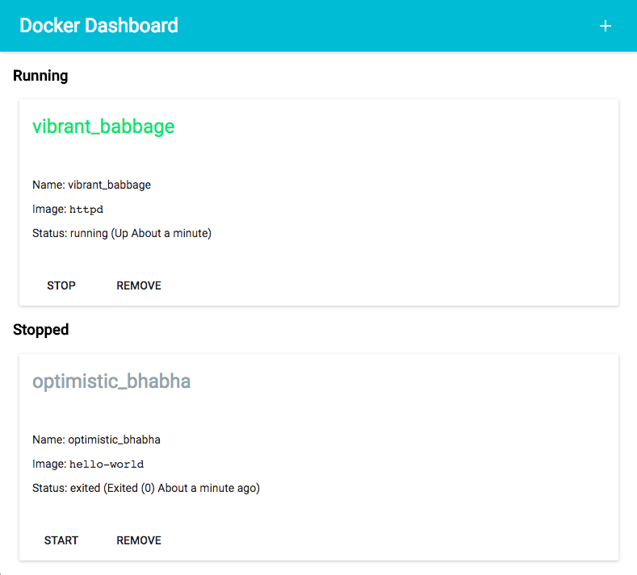
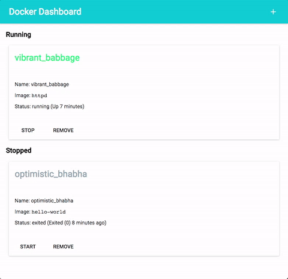

# docker-dashboard

Docker dashboard inspired by the Auth0 blog post using Material UI.

## Installation

Clone the repository and then run `npm install`.

## Running

`npm start` will start the application in development mode. This will watch for changes on both the server and the client code.

`npm run production` will run the webpack production build (`webpack -p`) and will not be watching for changes.

## Screenshot and Usage

## Resources

- [Inspiration](https://auth0.com/blog/docker-dashboard-with-react-typescript-socketio/)
- [Material UI Docs](http://www.material-ui.com/#/)
- [Material Design](https://material.io/)
- [Material Icons](https://material.io/icons/)
- [Formik](https://jaredpalmer.com/formik)
- [`yup`](https://github.com/jquense/yup)
- [`formik-material-ui`](https://github.com/stackworx/formik-material-ui)
